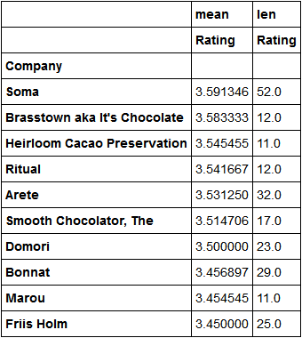
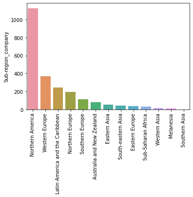
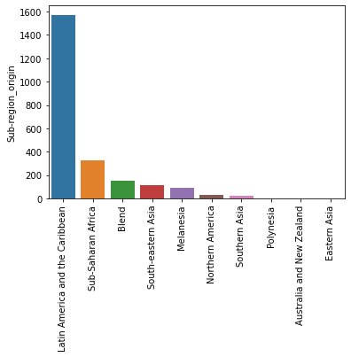

# Chocolate rating project
## Overview
- Analyzed a dataset of over 2300 chocolate bars' ratings scraped from http://flavorsofcacao.com/.
- Enriched the dataset with additional data about countries of bean origin and location of companies.
- Analyzed data distributions using multiple visualizations.
- Used feature engineering to encode variables such as Ingredients and Most Memorable Characteristics.
- Trained Linear Regression, Ridge Regression, SVM and CatBoost models to predict the rating of bars.
- Examined the CatBoost model to determined which features have most impact in predicting ratings.

## Data Collection

The data was taken from http://flavorsofcacao.com(last update on March 14, 2020). See also <a href="https://www.kaggle.com/rtatman/chocolate-bar-ratings">this Kaggle dataset</a> for an outdated version of the same data.

- The dataset was scraped from the HTML table http://flavorsofcacao.com/chocolate_database.html using BeautifulSoup. Some of the scraping code was taken from https://srome.github.io/Parsing-HTML-Tables-in-Python-with-BeautifulSoup-and-pandas/.

- In the original database each bar is described by the following features:
  - REF
  - Company (Manufacturer)
  - Company Location
  - Review Date
  - Country of Bean Origin
  - Specific Bean Origin or Bar Name
  - Cocoa Percent
  - Ingredients
  - Most Memorable Characteristics
  - Rating

- We enriched these features by adding the continent and sub-region of both Company Location and Country of Bean Origin. This was done by joining the table with geographical data taken from https://unstats.un.org/unsd/methodology/m49/.

- Company (Manufacturer) was parsed to get two distinct features for Company and Manufacturer.

## Exploratory Data Analysis

We analyzed the dataset by creating lots of visualizations and tables. The following are some examples.

- Soma is the top rated company among those which got more than 10 reviews:

Here are boxplots of rating distributions for the companies with most reviews:

- Most companies are located in Northern America:

while most of the cocoa beans have origin from Latin America and the Caribbean:

## Model Training

We trained four different Machine Learning models to predict the rating of a chocolate bar:

- Linear Regression: baseline model. Since the dataset's dimension got high after one hot encoding categorical variables, we applied feature selection before training the model. The number of features to keep (55) was selected via cross validation.

- Ridge Regression: we tried to regularize the Linear Regression model by applying ridge shrinking. Again we performed feature selection before training, this time keeping 95 features. We chose Ridge Regression over Lasso because it performed better.

- Support Vector Regressor: SVMs are usually good for small but high dimensional dataset. We used Scikit-Learn's LinearSVR because it is faster than SVR and experiments with the latter showed that the linear kernel performed better than other kernels. Hyperparameters were tuned via cross validation. This time we did not apply feature selection because the model performed better with all the features.

- CatBoost: our dataset has a lot of categorical features with high cardinality, so we trained a CatBoost model since it has an internal method of dealing with this type of features. Moreover, CatBoost provides a very nice functionality for calculating feature importance.

## Model Evaluation

We used RMSE as the evaluation metric in training all our models. Here are the results of the evaluations on the test set. For completeness, we also reported the MAE and the R^2.

| Model             | RMSE  | MAE   | R^2   |
|-------------------|-------|-------|-------|
| Linear Regression | 0.418 | 0.326 | 0.196 |
| Ridge Regression  | 0.409 | 0.320 | 0.229 |
| Linear SVR        | 0.398 | 0.311 | 0.270 |
| CatBoost          | 0.390 | 0.307 | 0.301 |

[work in progress]
